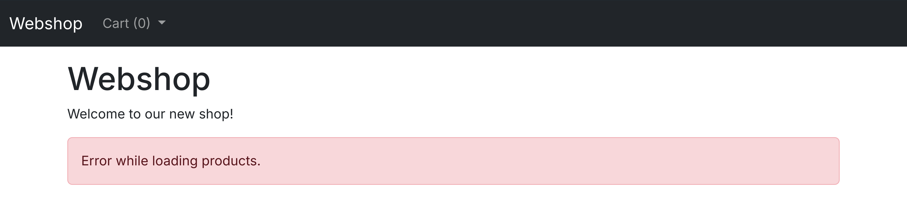
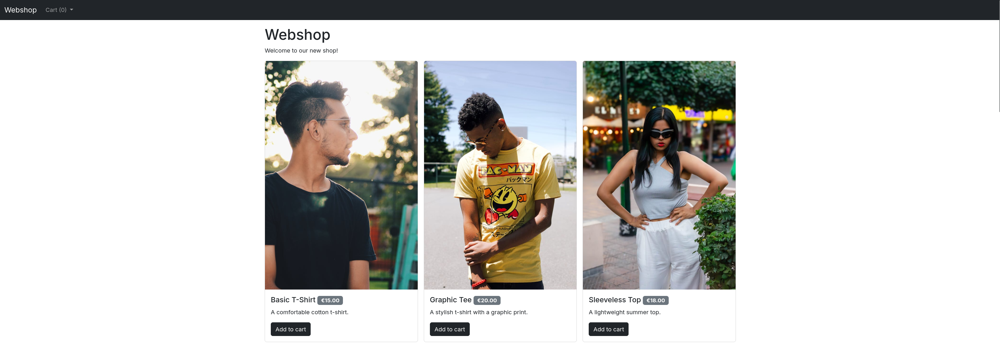
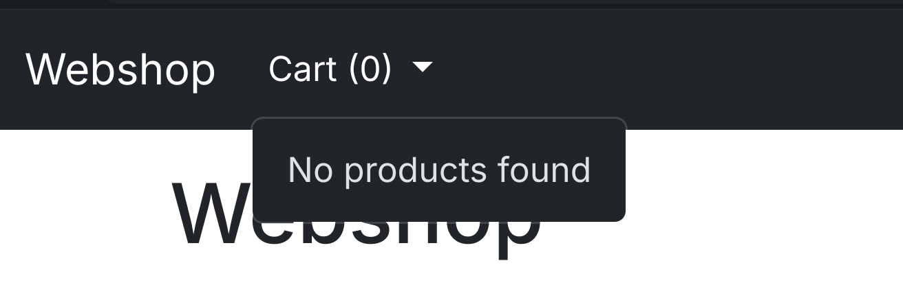
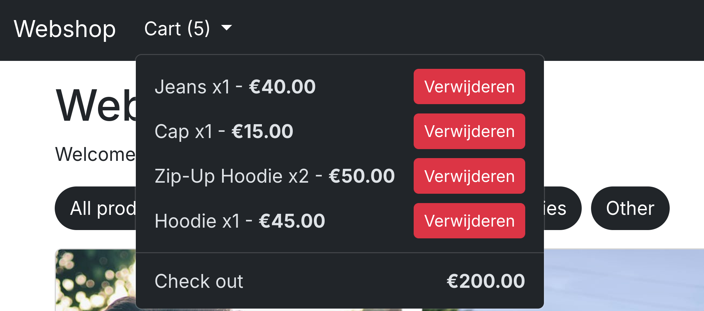
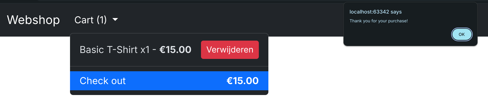

# PE Opdracht 2025 (30%)

Deze opdracht moet individueel en zelfstandig worden uitgevoerd.
Plagiaat tussen studenten is niet toegestaan.

Je mag gebruik maken van je eigen code of inspiratie halen uit voorbeelden en oplossingen die je online vindt.
Zorg er echter voor dat je deze begrijpt en correct integreert in jouw script.
Pas de code indien nodig aan je eigen behoeften aan.

Vergeet niet om in de code als commentaar de URL te vermelden van de bron waar je de oplossing hebt gevonden.
Daarnaast is het mogelijk dat je gevraagd wordt om je code toe te lichten en uit te leggen wat deze precies doet.
Het is daarom essentieel dat je begrijpt wat je van het internet overneemt en hoe het werkt.

Maak goed gebruik van dit git repository, voer dus regelmatig commits uit met een duidelijke en beschrijvende commit
message.

Probeer de UI in de screenshots zo goed mogelijk na te bouwen, maar als jouw oplossing kleine verschillen vertoond,
verlies je hier geen punten door.

## Webshop

Ontwikkel een gebruiksvriendelijke webshop waar gebruikers eenvoudig producten kunnen toevoegen aan hun winkelwagen.

### Data ophalen (4 punten)

De productinformatie wordt, via een _fetch_-verzoek, ingeladen vanuit het JSON-bestand in de startbestanden.

#### Foutmelding (1 punt)

Als het bestand niet gevonden kan worden, wordt er een duidelijke foutmelding weergegeven om de gebruiker te informeren
over het probleem.

### Producten renderen (5 punten)

Als de producten succesvol ingeladen worden via _fetch_ , moeten deze getoond worden zoals in onderstaand screenshot
(gebruik hiervoor een [Bootstrap Card](https://getbootstrap.com/docs/5.3/components/card/).

### Producten filteren (4 punten)

De webshop biedt verschillende filters waarmee gebruikers efficiënt door het assortiment kunnen navigeren.
Bij het selecteren van een filter worden alleen de producten in die specifieke categorie weergegeven.
Als je kiest voor 'Alle producten', worden alle beschikbare producten getoond.
Bij het laden van de pagina worden automatisch alle beschikbare producten getoond.

Let op: als het _fetch_ request mislukt is, zorg er dan voor dat de filters niet worden weergegeven.

### Winkelwagen

De winkelwagen wordt bovenaan de pagina weergegeven in een dropdown menu, als de applicatie start in de winkelwagen
natuurlijk leeg.

#### Opvullen/verwijderen/updaten (5 punten)

Wanneer een product aan de winkelwagen wordt toegevoegd, wordt de dropdown in het navigatiemenu onmiddellijk bijgewerkt.
De winkelwagen toont elk geselecteerd product, inclusief de hoeveelheid en prijs.
Gebruikers kunnen meerdere exemplaren van hetzelfde product toevoegen en eenvoudig een item per keer verwijderen met de
verwijderknop.
Als er meerdere stuks van een product in de winkelwagen staan en er één verwijderd wordt, blijft de resterende
hoeveelheid correct zichtbaar.
Het totaalbedrag wordt automatisch geüpdatet na elke wijziging.

#### Checkout (1 punt)

Wanneer de gebruiker op "Afrekenen" klikt, verschijnt een melding waarin wordt bevestigd dat de bestelling succesvol is
geplaatst.
Daarna wordt de winkelwagen geleegd, zodat het bestelproces opnieuw kan beginnen.

