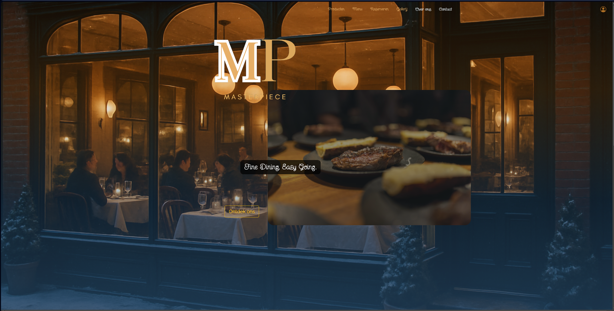

# MVC Groepsproject

Dit project is een groepswerk ontwikkeld volgens het **MVC-principe**.  
Het werd gerealiseerd over een periode van **6 weken**, waarbij er gewerkt werd met  
**dagelijkse stand-ups** en **wekelijkse sprint reviews** volgens de Agile-werkwijze.

## Mijn bijdrage
Binnen dit project heb ik de volgende pagina’s gebouwd of eraan meegewerkt:

- Homepagina
- Admin beheerpaneel
- Mailbeheer (overzicht, aanmaken, bewerken, verwijderen en versturen!)
- Wachtwoord vergeten & reset flow
- Toegang geweigerd pagina
- Logging van info naar de database

## Screenshots

