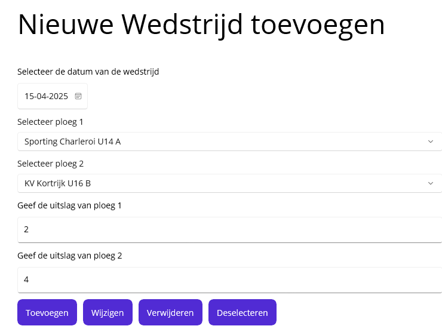
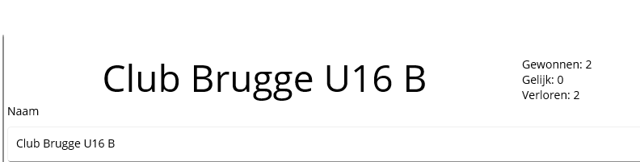
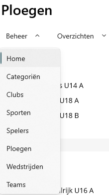
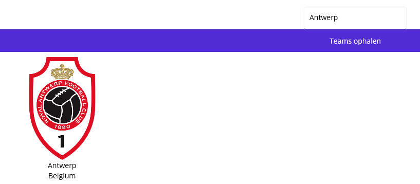
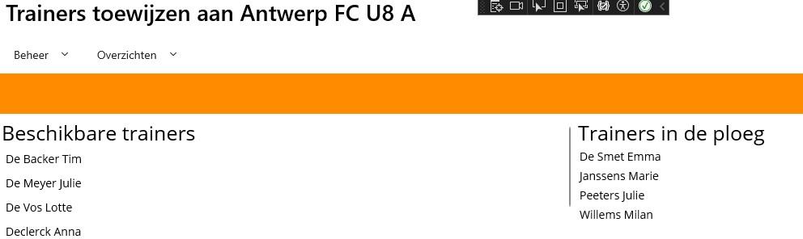

# Opdracht Wedstrijden
## Doel
Het doel van deze opdracht is een bestaand project in .net Maui uitbreiden met extra features. Er moet ook gebruik gemaakt worden van Branches.

## Setup
Op Canvas vind je een link naar een Github Classroom. Je werkt voor deze opdracht verplicht met 2 personen! Op de Classroom maak je voor jouw groepje een team aan. Beide teamleden clonen de startrepo van Github Classroom.

De startbestanden bevatten volgende gegevens:
- Sql waarmee je de database en tabellen kunt aanmaken. Hierin zit ook al dummydata voor de tabellen. Voer deze uit.
- Crud-functionaliteiten voor alle entiteiten behalve Wedstrijd
- Modellen opgesteld volgens onderstaand ERD:

## Opdracht
Gebruik voor elk van onderstaande features een nieuwe branch. Spreek als team af wie welke features aanpakt. Als je een feature klaar hebt, maak je een pull request aan om te mergen met de main-branch. Een andere student moet altijd de pull request reviewen! Dat wil zeggen dat je, in de comments van de pull request, in grote lijnen beschrijft wat er aangepast is in de code. Je verwijdert geen branches.

## Features
1.	Vraag een lijst van de huidige wedstrijden op.

2.	Voorzie een mogelijkheid om een Wedstrijd aan te maken, te wijzigen of te verwijderen.

3.	Pas in heel de applicatie de gepaste validatie toe! De foutboodschappen verschijnen in een label onder de titel. Werk efficiënt met methoden! bv
 

4.	Maak een lijst van alle clubs en de bijhorende ploegen.
 

5.	Geef een lijst van alle spelers per ploeg. 
 

6.	Maak een overzicht van hoeveel wedstrijden een ploeg gewonnen, verloren of gelijk gespeeld heeft. Werk efficiënt met methoden.

7.	Er zitten nog fouten in de navigatie. Los deze op en zorg dat er ook navigatie mogelijk is via tabs.

8.	Maak een nieuwe pagina met bijhorende ViewModel en Models om van volgende API (json) de gegevens binnen te halen en te deserializen.
https://www.thesportsdb.com/api/v1/json/3/search_all_teams.php?s=Soccer&c=Belgium
De pagina moet er als volgt uitzien:
 

9. Pas een zoekmogelijkheid toe om te zoeken op naam van een team. Zoek op https://www.thesportsdb.com/free_sports_api welke methode je hiervoor kunt gebruiken.

10. Voeg trainers toe aan een ploeg. Pas hiervoor de structuur van de database aan met behulp van een script. Voorzie modellen met navigation properties. Voor het model `Trainer` gebruik je dezelfde properties als in het model `Speler`. Voorzie ook een extra Page, Viewmodel, Interface en Repository. Je kunt je baseren op het toewijzen van Spelers aan een ploeg maar denk kritisch na zodat je geen overbodige dingen overneemt. Om het script aan te maken, kun je de hulp vragen aan AI om een 100-tal trainers te genereren en die toe te wijzen. Een trainer kan toegewezen worden aan meerdere ploegen, een ploeg kan meerdere trainers hebben.

