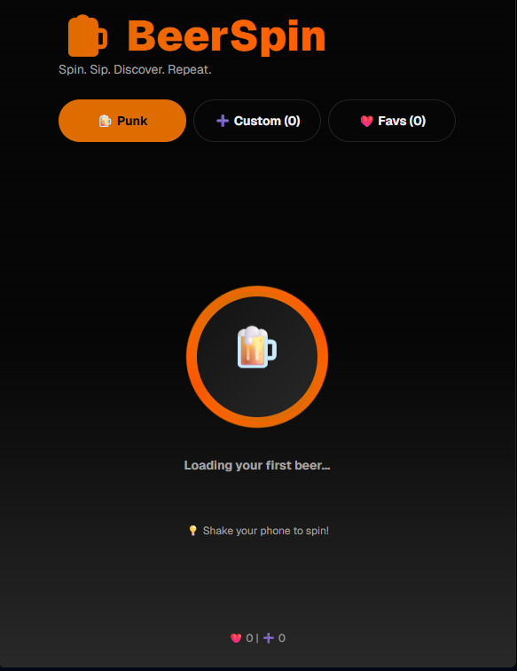
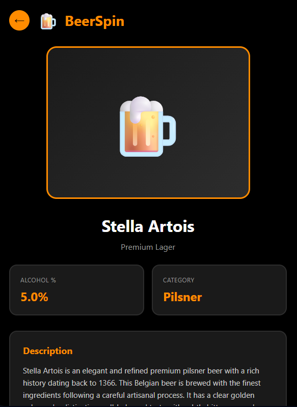
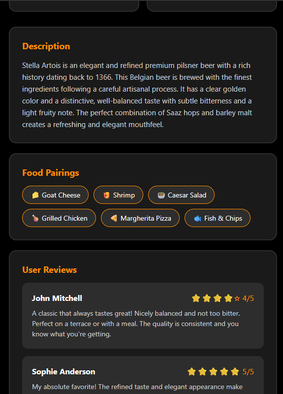
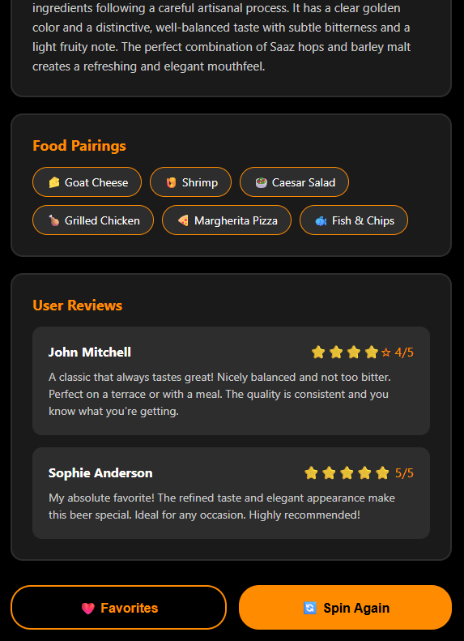

# Permanente evaluatie

## Home Page

**Beschrijving functionaliteiten:**

Dit is de homepagina van de applicatie.  Op dit scherm kan de gebruiker een willekeurig bier laten “spinnen”.

De gebruiker kiest zelf welke bieren deel uitmaken van deze roulette:
- bieren uit de PunkAPI, of
- bieren die de gebruiker zelf heeft toegevoegd aan de lokale database.

Er is ook een optie om enkel te spinnen tussen de favorieten,  zodat de gebruiker alleen bieren ziet die hij persoonlijk interessant vindt.

Zodra er een bier gekozen is, toont dit scherm de belangrijkste bierinformatie:

- Foto van het bier
- Naam
- Alcoholpercentage (ABV)
- Knop “Details” → opent het detail­scherm
- Knop “Favoriet” → slaat het bier op in de favorietenlijst (SQLite/MMKV)

**Extra functies** 

 - gesture: door de telefoon te schudden wordt via de accelerometer een nieuw random bier opgehaald.
- Animatie: het bierkaartje fade/slidet in bij elke nieuwe random pick.

## Detail pagina

 
 
 
 
 
 
 

**Beschrijving functionaliteiten**

Het detail­scherm toont alle info over een gekozen bier,  
zowel voor de data uit de api als voor die van de eigen database

Het scherm bevat minstens volgende attributen:

- Foto(niet verwerkt in afbeelding )
- Naam
- Alcoholpercentage
- Bierstijl / categorie
- Food pairings
- Omschrijving
- Eventueel: user review

**Extra functies** 
- Knop “Favoriet toevoegen/verwijderen”
- Knop “Bewerk eigen bier” (indien zelf toegevoegd)

**Persistentie**  
Favorieten worden opgeslagen in SQLite of MMKV en blijven beschikbaar na het sluiten van de app.

## Scherm: Favorietenlist

**Beschrijving functionaliteiten**

Dit scherm toont een overzicht van alle bieren die de gebruiker heeft opgeslagen als favoriet. 
 Deze worden uitgelezen vanuit de database.

Elk intem in deze lijst bevat minsten volgende onderdelen:
- Naam
- Alchohol percentage
- Afbeelding

Als de gebruiker op het item zelf klikt dan wordt hij verwezen naar de detail pagina.

**Interacties & gestures**

- Swipe-left gesture (custom):  De gebruiker kan een item naar links swipen om het te verwijderen uit de favorieten. 
Dit wordt niet met een standaardbibliotheek gedaan maar via een eigen implementatie  (bv. PanGestureHandler + Animated)

- Sorteren  De gebruiker kan de lijst sorteren op: 
    - Naam (A–Z / Z–A)
    - Alcoholpercentage (lage → hoge ABV / hoge → lage ABV)  
De sorteeroptie wordt toegepast op de dynamisch ingelezen lijst.

**Extra Functies**

- Zoekbalk om snel een favoriet bier te vinden
- Indicator wanneer de lijst nog leeg is (“Je hebt nog geen favorieten toegevoegd”) 

## crud scherm 

**Beschrijving functionaliteiten**

Dit is het scherm waar de gebruiker eigen bieren kan registreren. 
Een bier bevat minstens de volgende eigenschappen:

- Foto (met camera)
- Naam
- Type / categorie
- Alcoholpercentage
- Smaakprofiel
- Notities
- Datum toegevoegd

Functionaliteiten:

- Camera integratie → gebruiker neemt zelf een foto

**Formulier met validatie**

- Naam verplicht
- Alcoholpercentage moet numeriek zijn
- Minimale lengte voor notities

Daarna verschijnt het bier in de favorietenlijst of in een aparte “Eigen bieren” sectie

CRUD

C → Bier toevoegen

R → Detail bekijken

U → Bier bewerken

D → Bier verwijderen via swipe

## Native modules

1. Camera (expo-camera)

Wordt gebruikt om een foto van een eigen bier te maken. 
Dit is een klassieke native module die duidelijk toont dat je hardware aanstuurt.

2. Accelerometer (expo-sensors)

Wordt gebruikt om te detecteren wanneer de gebruiker schudt. 
Bij detectie wordt een nieuw random bier opgehaald van de punkAPI of database of favorieten lijst.

3. Persistentie via SQLite (nog te bespreken)

SQLite is intern een native module die database-opslag aanbiedt.
Ik gebruik deze om:
- favorieten op te slaan 
- eigen bieren op te slaan
- user-generated data te bewaren

## Online services

1. PunkAPI

Deze free api ga ik gebruiken om data op te halen over verschilende bieren,  zodat ik geen moet gaan simuleren.  
concreet wordt het gebruikt voor volgende aspecten: 

- Een random bier op te halen
- Detailinformatie over dit bier te tonen

2. Supabase

Eventueel zou ik mijn database graag online zetten d.m.v supabase.  
Zodat deze altijd online beschikbaar is voor iedere bevoegde die hem nodig heeft.

## Gestures & animaties

Gesture

- Shake gesture (accelerometer) → nieuw random bier
- Swipe-left-to-delete op de favorietenlijst

Animatie

- Het wisselen van een random bier toont een fade-in of slide-in animatie
- Eventueel nog een animatie toevoegen bij het openen/sluiten van detailschermen

# Feedback

Duidelijke beschrijving van de functionaliteiten met een concreet doel voor bv. eventuele gestures. 
Alle minimum vereisten worden ook vermeld. 
Lijkt me zeker haalbaar.
