# Info

## Online Services
- API van sampleapis.com gebruikt om een lijst van random bieren te krijgen
- Firebase gebruikt als database + user authentication

## Native Modules
- Accelerometer* 
  → Terug te vinden op de home page (`main / index`)   
u kan deze testen door de virtual sensor van de emulator
- Haptics* 
  → Trillen wanneer de gebruiker de gsm schudt

Ik raad aan om met de z ass te spelen voor een bier te laten spinnen. Anders flip de gsm onderste boven ;)  
Zie zeker ook dat hij op move staat en niet op rotate. Anders pakt de emulator het niet op als een movement en spinned er geen bier.

## Gesture & Animation
- Swipe op elk custom beer item
    - Swipe links → navigatie naar de detail page

---

## Functionaliteiten

- Gebruiker kan inloggen via zijn **Google account**
- Op de **main page** kan de gebruiker:
    - Een random beer spinnen uit de API, eigen bieren, favorieten
    - Eigen bieren bekijken
    - Favorieten bekijken
- Navigeren naar:
    - (MyBeers) via het plus-icoon onderaan
    - (MyFavorites) via het hart-icoon onderaan
- Voor elk gespind bier:
    - Navigeren naar de detail pagina
    - Toevoegen aan favorieten
- CRUD-operaties uitvoeren voor eigen bieren
    - Eigen bieren worden opgeslagen in Firebase

---

## Firebase Structuur

### Custom Bier
Dit is hoe een custom bier wordt opgeslagen in Firebase:  

### Favorieten
Dit is hoe favorieten worden opgeslagen in Firebase:  

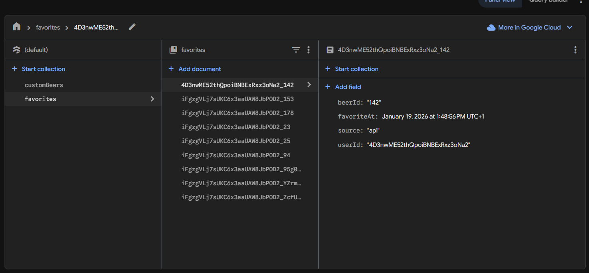

### Screenshots:
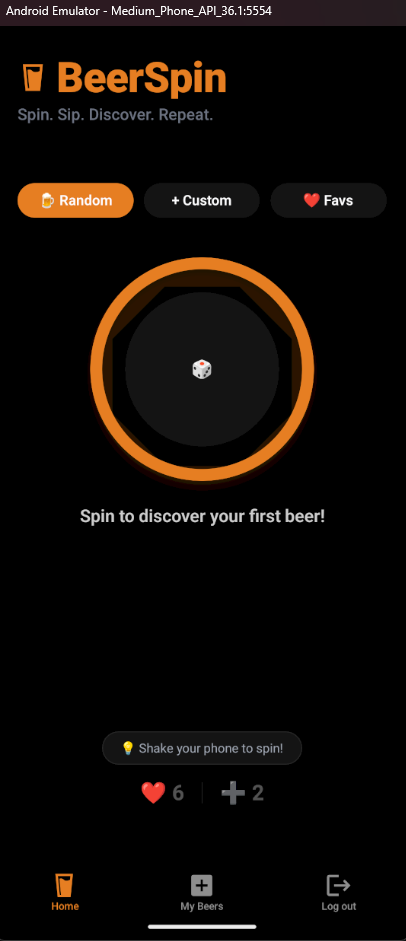    

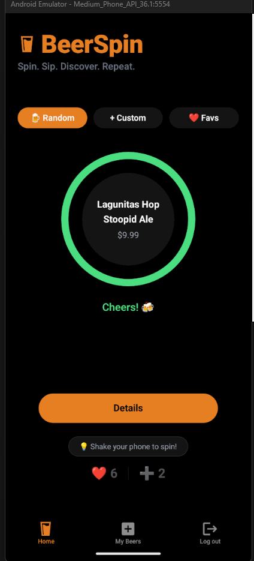    
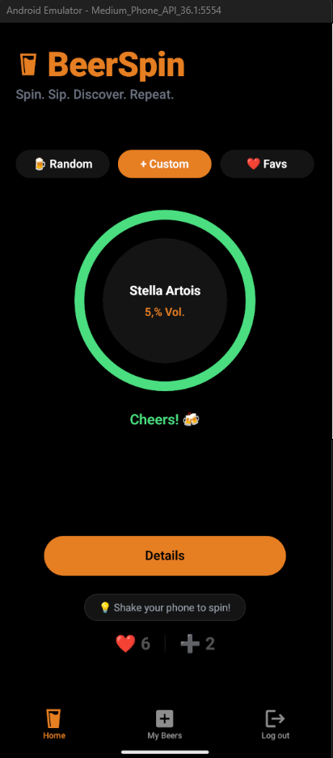    
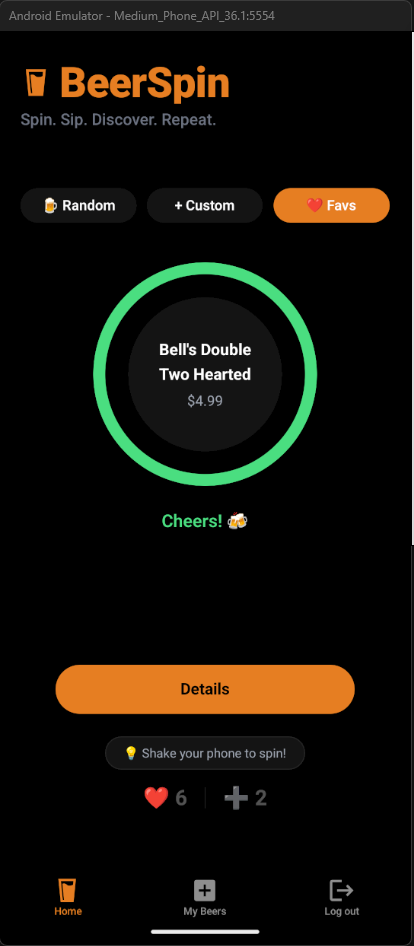    

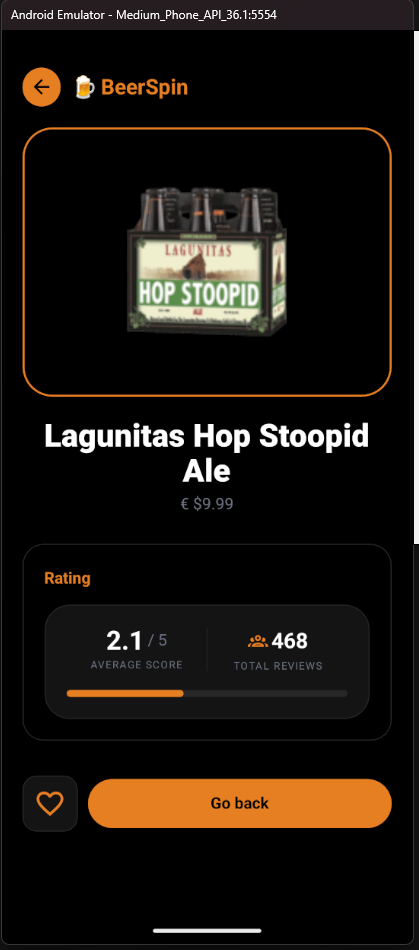   
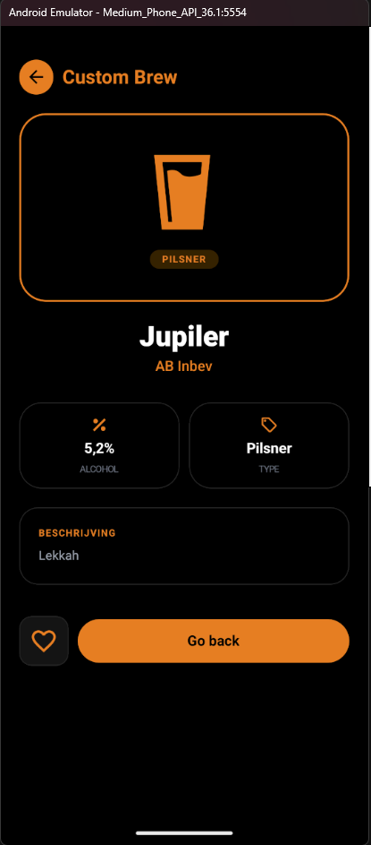    

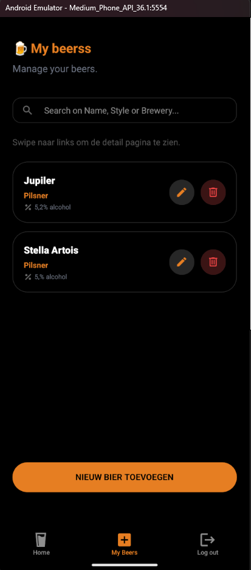    
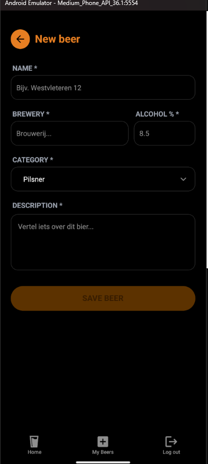    
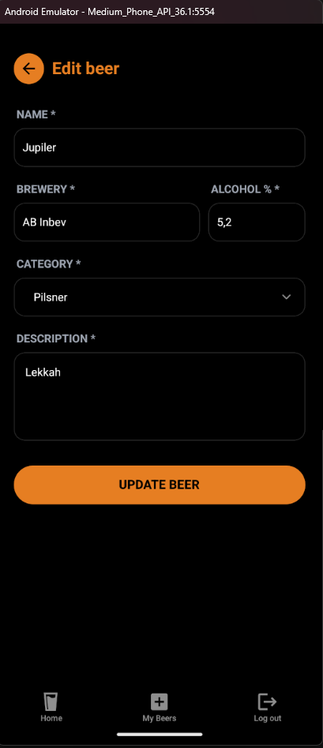    

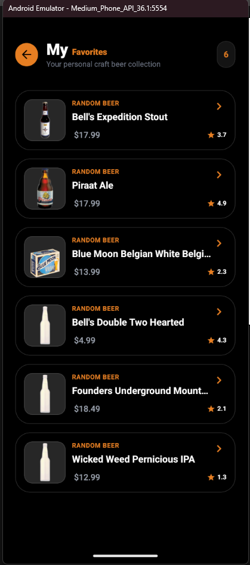    
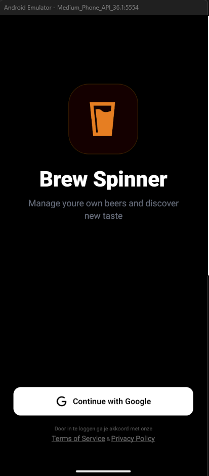    

